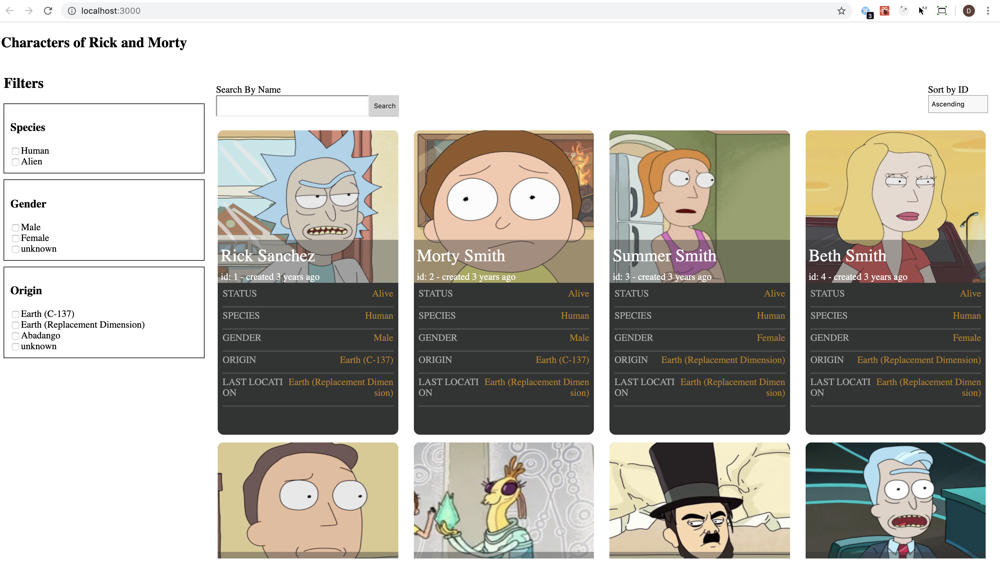

# Browse all the characters of Rick and Morty Show

This is a server side renderning based application developed using React and Redux.

### Steps:
1. yarn install
2. yarn lint - for standard linting process
3. yarn start - to build and start the application (will start the app at localhost:3000)

